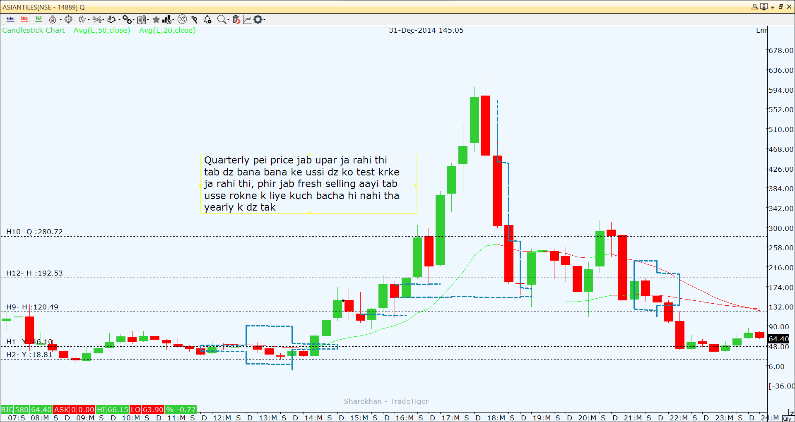

# Asiantiles

### Yearly

Tested the yearly demand zone and is currently moving with its support (Range - 46.15-20.55)

### Half Yearly

Similar structure of demand is found coinciding with yearly demand zone in half yearly chart. 

Next fresh Half yearly supply zone @ 139.95-192

### Quarterly

Quarterly ke saare demand zone tested thee, jab price down aa rahi thi tab,
yearly k zone mei coinciding krta hua quarterly zone hi bacha tha.

2 fresh good quarterly zones are available at 139.95-192 with half yearly SZ same structure. And another one is at 280-315.

### Monthly

Monthly mei sirf 2 fresh demand zones bache thee unke pehle k jo thee woh price ko hold aur pullback de rahe thee unme bhi ache khase hi chale thee. origin areas ke. 

Agar thik se dekhe toh asiantiles origin area ke zones ko zyada value deta hai.

Ab rahi baat fresh demand zones ki toh stock ne aggressive monthly k zone ko breach krke yearly k coinciding vale zone se reversal diya. 

Price 34 rs. se 84 rs. gayi aur ab vapis down aa rahi hai.

Iss baar price ne up jaate jaate 2 RBR zones banaye hai.